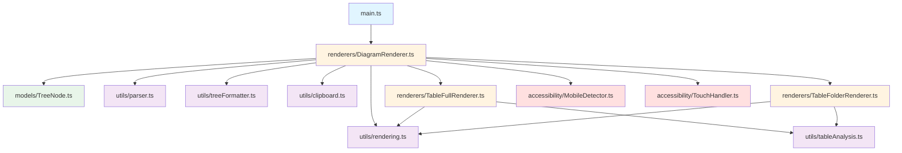
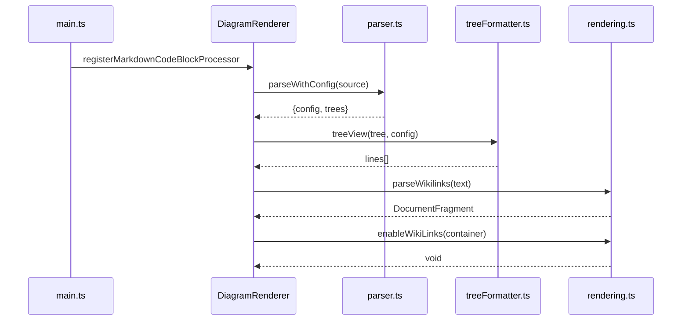
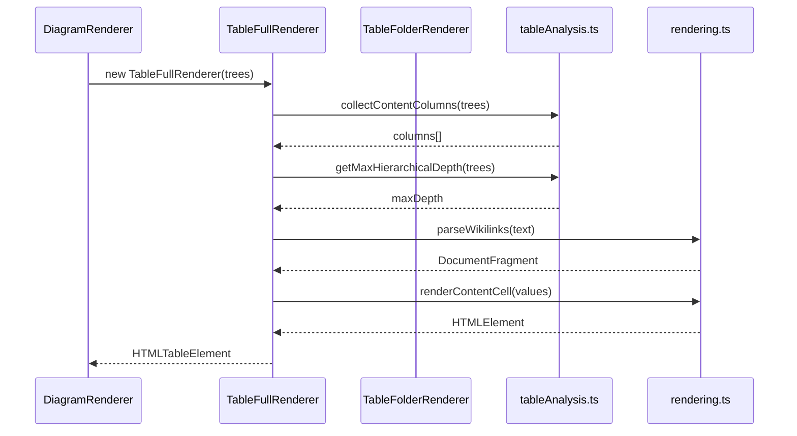

# Design Document: Code Refactoring - Modular Structure

## Overview

This refactoring reorganizes the codebase to improve maintainability, eliminate code duplication, and establish clear module boundaries. The current codebase suffers from three main issues: (1) util.ts is a 500-line file mixing parser, formatter, wikilink, and clipboard concerns, (2) TreeDiagramMarkdownRenderChild.ts is a 600-line orchestrator combining rendering logic with UI management, and (3) 80 lines of duplicated parseWikilinks code exists between TableModeA and TableModeB renderers.

The refactoring will split these large files into focused modules organized by responsibility, extract duplicated code into shared utilities, and establish a clear directory structure that separates models, utilities, renderers, and accessibility features. This will reduce the codebase by approximately 450 lines (-22%) while improving code organization and testability.

## Architecture



## Sequence Diagrams

### Main Rendering Flow



### Table Rendering Flow



## Components and Interfaces

### Component 1: Parser Module (utils/parser.ts)

**Purpose**: Parse text input into tree node structures with configuration

**Interface**:
```typescript
interface TreeConfig {
  interactive: boolean;
  startShowLevel: number;
  levelNumbered: number;
  title: string;
  offsetLevelNumbered: number;
  currentView: number;
}

interface ParseResult {
  config: TreeConfig;
  trees: TreeNode[];
}

function parseConfig(source: string): { config: TreeConfig; contentStart: number }
function parseLine(text: string): { depth: number; name: string; link: WikiLink | null }
function parseInput(source: string): TreeNode | null
function parseMultiInput(source: string): TreeNode[]
function parseWithConfig(source: string): ParseResult
function buildTabTree(folder: TFolder, includeFiles: boolean, depth: number): string[]
```

**Responsibilities**:
- Parse configuration flags from source text
- Parse individual lines into node properties
- Build tree hierarchies from tab-indented text
- Handle multiple tree structures
- Parse folder structures into tab trees

### Component 2: Tree Formatter Module (utils/treeFormatter.ts)

**Purpose**: Format tree nodes into ASCII diagram lines

**Interface**:
```typescript
function treeView(
  root: TreeNode,
  interactive: boolean,
  expandedNodes: Set<string>,
  nodePath: string,
  levelNumbered: number,
  numberPrefix: string,
  startShowLevel: number,
  levelNumberOffset: number
): string[]
```

**Responsibilities**:
- Generate ASCII tree diagram lines
- Handle interactive expand/collapse indicators
- Apply hierarchical numbering
- Manage visibility levels
- Format branch characters and indentation

### Component 3: Clipboard Module (utils/clipboard.ts)

**Purpose**: Handle clipboard operations

**Interface**:
```typescript
function copyToClipboard(text: string): Promise<boolean>
```

**Responsibilities**:
- Copy text to system clipboard
- Handle Electron and browser clipboard APIs
- Provide fallback mechanisms

### Component 4: Rendering Utilities Module (utils/rendering.ts)

**Purpose**: Shared rendering utilities for wikilinks and content cells

**Interface**:
```typescript
function parseWikilinks(text: string): DocumentFragment
function enableWikiLinks(container: HTMLElement, app: any, sourcePath: string): void
function renderContentCell(values: string[]): HTMLElement
```

**Responsibilities**:
- Parse wikilink syntax into HTML elements
- Enable click and hover behavior for wikilinks
- Render content cells with multiple values
- Handle mixed text and wikilink content

### Component 5: Table Analysis Module (utils/tableAnalysis.ts)

**Purpose**: Analyze tree structures for table rendering

**Interface**:
```typescript
class TableDetector {
  static hasCapital(name: string): boolean
  static isHierarchical(node: TreeNode): boolean
  static isContentColumn(node: TreeNode): boolean
  static collectContentColumns(trees: TreeNode[]): string[]
  static getMaxHierarchicalDepth(trees: TreeNode[]): number
  static capitalizeFirst(str: string): string
  static handleDuplicates(names: string[]): string[]
  static escapeHtml(text: string): string
}

function extractContent(node: TreeNode): Map<string, string[]>
```

**Responsibilities**:
- Detect hierarchical vs content nodes
- Collect content column names
- Calculate tree depth
- Extract content values from nodes
- Provide string utilities

### Component 6: Diagram Renderer (renderers/DiagramRenderer.ts)

**Purpose**: Main orchestrator for rendering tree diagrams (renamed from TreeDiagramMarkdownRenderChild)

**Interface**:
```typescript
type ViewMode = 'tree' | 'table-a' | 'table-b'

class DiagramRenderer extends MarkdownRenderChild {
  constructor(plugin: TreeDiagramPlugin, source: string, containerEl: HTMLElement, ctx: MarkdownPostProcessorContext)
  
  async onload(): void
  render(): void
  renderTreeView(contentArea: HTMLElement): void
  renderTableModeA(wrapper: HTMLElement): void
  renderTableModeB(wrapper: HTMLElement): void
  renderTopControlBar(contentArea: HTMLElement): void
  renderSettingsPanel(mainLayout: HTMLElement): void
  toggleTreeVisibility(): void
  toggleNode(path: string): void
}
```

**Responsibilities**:
- Orchestrate rendering workflow
- Manage view mode switching
- Handle user interactions
- Coordinate between parsers and renderers
- Manage settings panel state

### Component 7: Table Full Renderer (renderers/TableFullRenderer.ts)

**Purpose**: Render full table view with rowspan (renamed from TableModeA)

**Interface**:
```typescript
class TableFullRenderer {
  constructor(trees: TreeNode[])
  render(): HTMLTableElement
}
```

**Responsibilities**:
- Flatten tree to leaf paths
- Calculate rowspan for cells
- Render full table with vertical merging
- Use shared rendering utilities

### Component 8: Table Folder Renderer (renderers/TableFolderRenderer.ts)

**Purpose**: Render folder table view with drill-down (renamed from TableModeB)

**Interface**:
```typescript
class TableFolderRenderer {
  constructor(trees: TreeNode[], navigationStack: string[], onNavigate?: (stack: string[]) => void)
  render(): HTMLElement
}
```

**Responsibilities**:
- Manage navigation stack
- Render current subtree
- Handle breadcrumb navigation
- Use shared rendering utilities

## Data Models

### Model 1: TreeNode

```typescript
interface WikiLink {
  target: string;
  alias: string;
}

class TreeNode {
  name: string;
  depth: number;
  parent: TreeNode | null;
  children: TreeNode[];
  isLast: boolean;
  link: WikiLink | null;
  
  constructor(name: string, depth: number, parent: TreeNode | null, isLast: boolean, link: WikiLink | null)
  addChild(child: TreeNode): void
  setParent(p: TreeNode): void
  setIsLast(v: boolean): void
  setDepth(d: number): void
}
```

**Validation Rules**:
- name must be non-empty string
- depth must be non-negative integer
- children array must contain only TreeNode instances
- link must be null or valid WikiLink object

### Model 2: TreeConfig

```typescript
interface TreeConfig {
  interactive: boolean;
  startShowLevel: number;
  levelNumbered: number;
  title: string;
  offsetLevelNumbered: number;
  currentView: number;
}
```

**Validation Rules**:
- interactive must be boolean
- startShowLevel must be non-negative integer (0 = collapsed, 1+ = show levels)
- levelNumbered must be non-negative integer (0 = no numbering)
- title can be empty string
- offsetLevelNumbered must be non-negative integer
- currentView must be 1 (tree), 2 (table-a), or 3 (table-b)

### Model 3: ParseResult

```typescript
interface ParseResult {
  config: TreeConfig;
  trees: TreeNode[];
}
```

**Validation Rules**:
- config must be valid TreeConfig object
- trees must be array of TreeNode instances (can be empty)

## Algorithmic Pseudocode

### Main Refactoring Algorithm

```pascal
ALGORITHM refactorCodebase()
INPUT: Current codebase structure
OUTPUT: Refactored codebase with modular structure

BEGIN
  // Phase 1: Create new directory structure
  CREATE directories:
    - src/models/
    - src/utils/
    - src/renderers/
    - src/accessibility/
  
  // Phase 2: Move and split util.ts
  EXTRACT from util.ts:
    - parseConfig, parseLine, parseInput, parseMultiInput, parseWithConfig, buildTabTree
      → utils/parser.ts
    - treeView
      → utils/treeFormatter.ts
    - copyToClipboard
      → utils/clipboard.ts
    - TreeConfig, ParseResult interfaces
      → utils/parser.ts
  
  // Phase 3: Create new shared rendering utilities
  CREATE utils/rendering.ts:
    - EXTRACT parseWikilinks from TableModeA.ts
    - EXTRACT enableWikiLinks from util.ts
    - CREATE renderContentCell (new function combining common logic)
  
  // Phase 4: Move and refactor table renderers
  MOVE TableModeA.ts → renderers/TableFullRenderer.ts
    - REMOVE parseWikilinks method (use utils/rendering.ts)
    - UPDATE imports
  
  MOVE TableModeB.ts → renderers/TableFolderRenderer.ts
    - REMOVE parseWikilinks method (use utils/rendering.ts)
    - UPDATE imports
  
  // Phase 5: Move and enhance table analysis
  MOVE TableDetector.ts → utils/tableAnalysis.ts
  ADD extractContent function to utils/tableAnalysis.ts
    - EXTRACT from TableModeA and TableModeB
  
  // Phase 6: Rename and refactor main renderer
  MOVE TreeDiagramMarkdownRenderChild.ts → renderers/DiagramRenderer.ts
    - UPDATE class name
    - UPDATE imports
  
  // Phase 7: Move node model
  MOVE node.ts → models/TreeNode.ts
  
  // Phase 8: Move accessibility modules
  MOVE MobileDetector.ts → accessibility/MobileDetector.ts
  MOVE TouchHandler.ts → accessibility/TouchHandler.ts
  
  // Phase 9: Update all imports
  FOR each file IN codebase DO
    UPDATE import statements to reflect new structure
  END FOR
  
  // Phase 10: Delete old files
  DELETE util.ts
  DELETE TableModeA.ts
  DELETE TableModeB.ts
  DELETE TableDetector.ts
  DELETE TreeDiagramMarkdownRenderChild.ts
  DELETE node.ts
  
  RETURN refactored codebase
END
```

**Preconditions**:
- All source files exist and are readable
- No uncommitted changes in version control
- Build system is functional
- Tests pass (if any exist)

**Postconditions**:
- All functionality preserved (no behavior changes)
- Code duplication eliminated
- File count increased but total lines decreased
- Clear module boundaries established
- All imports updated correctly
- Build succeeds
- Tests pass (if any exist)

**Loop Invariants**:
- All moved code maintains original functionality
- Import paths remain valid throughout refactoring
- No circular dependencies introduced

### Parse Wikilinks Algorithm

```pascal
ALGORITHM parseWikilinks(text)
INPUT: text containing wikilink syntax [[target|alias]] or [[target]]
OUTPUT: DocumentFragment with text nodes and link elements

BEGIN
  fragment ← createDocumentFragment()
  wikilinkRegex ← /\[\[([^\]|]+)(?:\|([^\]]+))?\]\]/g
  lastIndex ← 0
  
  WHILE match ← wikilinkRegex.exec(text) DO
    // Add text before wikilink
    IF match.index > lastIndex THEN
      textNode ← createTextNode(text.substring(lastIndex, match.index))
      fragment.appendChild(textNode)
    END IF
    
    // Extract target and alias
    target ← match[1].trim()
    alias ← match[2] ? match[2].trim() : target
    
    // Create link element
    link ← createElement('a')
    link.className ← 'internal-link'
    link.setAttribute('data-href', target)
    link.textContent ← alias
    fragment.appendChild(link)
    
    lastIndex ← match.index + match[0].length
  END WHILE
  
  // Add remaining text
  IF lastIndex < text.length THEN
    textNode ← createTextNode(text.substring(lastIndex))
    fragment.appendChild(textNode)
  END IF
  
  RETURN fragment
END
```

**Preconditions**:
- text is a valid string (can be empty)
- DocumentFragment API is available

**Postconditions**:
- Returns valid DocumentFragment
- All wikilinks are converted to link elements
- Plain text is preserved as text nodes
- Original text order is maintained

**Loop Invariants**:
- lastIndex tracks position in text
- All text before lastIndex has been processed
- fragment contains all processed content

### Extract Content Algorithm

```pascal
ALGORITHM extractContent(node)
INPUT: node of type TreeNode
OUTPUT: Map<string, string[]> mapping column names to values

BEGIN
  contentMap ← new Map<string, string[]>()
  
  PROCEDURE traverse(n)
  BEGIN
    IF isContentColumn(n) THEN
      values ← []
      
      // Collect all child values
      IF n.children AND n.children.length > 0 THEN
        FOR each child IN n.children DO
          IF child.name THEN
            IF child.link THEN
              // Has wikilink
              IF child.name = child.link.alias OR child.name.trim() = '' THEN
                values.push([[child.link.target|child.link.alias]])
              ELSE
                values.push(child.name [[child.link.target|child.link.alias]])
              END IF
            ELSE
              // Plain text
              values.push(child.name)
            END IF
          ELSE IF child.link THEN
            // Only wikilink, no name
            values.push([[child.link.target|child.link.alias]])
          END IF
        END FOR
      END IF
      
      contentMap.set(n.name, values)
    END IF
    
    IF n.children THEN
      FOR each child IN n.children DO
        traverse(child)
      END FOR
    END IF
  END PROCEDURE
  
  traverse(node)
  RETURN contentMap
END
```

**Preconditions**:
- node is a valid TreeNode instance
- isContentColumn function is available

**Postconditions**:
- Returns Map with content column names as keys
- Each value is array of strings (can be empty)
- All content nodes in subtree are processed
- Wikilinks are formatted correctly

**Loop Invariants**:
- All visited nodes have been processed
- contentMap contains all content found so far
- Tree structure remains unchanged

## Key Functions with Formal Specifications

### Function 1: parseWithConfig()

```typescript
function parseWithConfig(source: string): ParseResult
```

**Preconditions:**
- `source` is a valid string (can be empty)
- String contains valid tree syntax with optional config flags

**Postconditions:**
- Returns valid ParseResult object
- `result.config` contains parsed or default configuration
- `result.trees` contains array of parsed trees (can be empty)
- No side effects on input string

**Loop Invariants:** N/A (delegates to other functions)

### Function 2: treeView()

```typescript
function treeView(
  root: TreeNode,
  interactive: boolean,
  expandedNodes: Set<string>,
  nodePath: string,
  levelNumbered: number,
  numberPrefix: string,
  startShowLevel: number,
  levelNumberOffset: number
): string[]
```

**Preconditions:**
- `root` is a valid TreeNode instance
- `expandedNodes` is a valid Set (can be empty)
- `nodePath` is a valid string
- `levelNumbered`, `startShowLevel`, `levelNumberOffset` are non-negative integers
- `numberPrefix` is a valid string

**Postconditions:**
- Returns array of formatted strings representing tree lines
- Each line corresponds to a visible node
- Interactive indicators are included if `interactive` is true
- Numbering is applied according to `levelNumbered` and `levelNumberOffset`
- Visibility respects `startShowLevel` and `expandedNodes`
- No mutations to input parameters

**Loop Invariants:**
- Queue contains nodes to be processed
- All processed nodes have been added to output
- Tree structure remains unchanged

### Function 3: parseWikilinks()

```typescript
function parseWikilinks(text: string): DocumentFragment
```

**Preconditions:**
- `text` is a valid string (can be empty)
- DocumentFragment API is available

**Postconditions:**
- Returns valid DocumentFragment
- All wikilinks `[[target|alias]]` or `[[target]]` are converted to link elements
- Plain text is preserved as text nodes
- Original text order and content are maintained
- No side effects on input string

**Loop Invariants:**
- `lastIndex` tracks current position in text
- All text before `lastIndex` has been processed and added to fragment
- Fragment contains all processed content in correct order

### Function 4: extractContent()

```typescript
function extractContent(node: TreeNode): Map<string, string[]>
```

**Preconditions:**
- `node` is a valid TreeNode instance
- `isContentColumn` function is available and correct

**Postconditions:**
- Returns Map with content column names as keys
- Each value is array of strings (can be empty)
- All content nodes in subtree are processed
- Wikilinks are formatted as `[[target|alias]]` strings
- No mutations to input node or tree structure

**Loop Invariants:**
- All visited nodes have been processed
- `contentMap` contains all content found in visited nodes
- Tree structure remains unchanged during traversal

## Example Usage

### Example 1: Basic Refactoring Workflow

```typescript
// Before refactoring - importing from util.ts
import { parseInput, treeView, copyToClipboard } from './util';

// After refactoring - importing from specific modules
import { parseInput } from './utils/parser';
import { treeView } from './utils/treeFormatter';
import { copyToClipboard } from './utils/clipboard';

// Usage remains the same
const tree = parseInput(source);
const lines = treeView(tree, false, new Set(), '', 0, '1', 999, 0);
await copyToClipboard(lines.join('\n'));
```

### Example 2: Using Shared Rendering Utilities

```typescript
// Before refactoring - duplicated in TableModeA and TableModeB
private parseWikilinks(text: string): DocumentFragment {
  // 40 lines of duplicated code...
}

// After refactoring - shared utility
import { parseWikilinks, renderContentCell } from '../utils/rendering';

// In TableFullRenderer or TableFolderRenderer
const fragment = parseWikilinks(value);
td.appendChild(fragment);

// Or use the new helper
const cell = renderContentCell(values);
tr.appendChild(cell);
```

### Example 3: Using Table Analysis Utilities

```typescript
// Before refactoring - TableDetector in root
import { TableDetector } from './TableDetector';

// After refactoring - organized in utils
import { TableDetector, extractContent } from './utils/tableAnalysis';

// Usage
const columns = TableDetector.collectContentColumns(trees);
const contentMap = extractContent(node);
```

### Example 4: Renamed Renderer

```typescript
// Before refactoring
import { TreeDiagramMarkdownRenderChild } from './TreeDiagramMarkdownRenderChild';

// After refactoring - clearer name
import { DiagramRenderer } from './renderers/DiagramRenderer';

// Usage in main.ts
this.registerMarkdownCodeBlockProcessor("tree", (source, el, ctx) => {
  ctx.addChild(new DiagramRenderer(this, source, el, ctx));
});
```

## Correctness Properties

### Property 1: Functionality Preservation
**∀ input ∈ ValidInputs**: `behavior_before(input) = behavior_after(input)`

All functionality must remain identical after refactoring. No user-visible changes in behavior.

### Property 2: Code Duplication Elimination
**∀ code_block ∈ Codebase**: `occurrences(code_block) ≤ 1`

No code block should appear more than once. Specifically, `parseWikilinks` should exist in exactly one location.

### Property 3: Import Correctness
**∀ import_statement ∈ Codebase**: `resolves(import_statement) = true`

All import statements must resolve to valid module paths. No broken imports.

### Property 4: Module Cohesion
**∀ module ∈ Modules**: `single_responsibility(module) = true`

Each module should have a single, well-defined responsibility. No mixed concerns.

### Property 5: Line Count Reduction
`total_lines_after < total_lines_before ∧ (total_lines_before - total_lines_after) ≥ 400`

Total lines of code should decrease by at least 400 lines due to duplication elimination.

### Property 6: Build Success
`build(refactored_codebase) = SUCCESS`

The refactored codebase must build successfully without errors.

### Property 7: No Circular Dependencies
**∀ module_a, module_b ∈ Modules**: `¬(depends(module_a, module_b) ∧ depends(module_b, module_a))`

No circular dependencies should exist between modules.

## Error Handling

### Error Scenario 1: Import Resolution Failure

**Condition**: Import statement cannot resolve to valid module after refactoring
**Response**: Build fails with clear error message indicating missing module
**Recovery**: Update import path to correct location in new structure

### Error Scenario 2: Missing Function After Split

**Condition**: Function called but not found in expected module after split
**Response**: Runtime error or build error indicating undefined function
**Recovery**: Verify function was moved to correct module and import is updated

### Error Scenario 3: Circular Dependency Introduced

**Condition**: Module A imports Module B which imports Module A
**Response**: Build system detects circular dependency and fails
**Recovery**: Refactor to extract shared code into third module or restructure dependencies

### Error Scenario 4: Broken Wikilink Rendering

**Condition**: Wikilinks not rendering correctly after extracting parseWikilinks
**Response**: Links appear as plain text or broken HTML
**Recovery**: Verify parseWikilinks is correctly imported and called, check enableWikiLinks is called after DOM insertion

## Testing Strategy

### Unit Testing Approach

**Parser Module Tests**:
- Test parseConfig with various flag combinations
- Test parseLine with different indentation levels and wikilink formats
- Test parseInput with single and multiple trees
- Test parseWithConfig integration

**Tree Formatter Tests**:
- Test treeView with different configurations
- Test interactive mode with expanded/collapsed nodes
- Test numbering with various offset values
- Test visibility levels

**Rendering Utilities Tests**:
- Test parseWikilinks with various wikilink formats
- Test parseWikilinks with mixed text and links
- Test renderContentCell with multiple values
- Test enableWikiLinks click and hover behavior

**Table Analysis Tests**:
- Test isHierarchical and isContentColumn detection
- Test collectContentColumns across multiple trees
- Test getMaxHierarchicalDepth calculation
- Test extractContent with nested structures

**Coverage Goals**: 80%+ line coverage for all utility modules

### Property-Based Testing Approach

**Property Test Library**: fast-check (TypeScript)

**Property 1: Parse-Format Roundtrip**
```typescript
// For any valid tree structure, parsing and formatting should be reversible
property("parse-format roundtrip", 
  fc.array(fc.record({
    name: fc.string(),
    depth: fc.nat(5),
    children: fc.array(...)
  })),
  (trees) => {
    const formatted = trees.map(t => treeView(t, ...)).flat().join('\n');
    const parsed = parseInput(formatted);
    return structurallyEqual(trees, parsed);
  }
);
```

**Property 2: Wikilink Preservation**
```typescript
// Parsing wikilinks should preserve all link information
property("wikilink preservation",
  fc.string().filter(s => s.includes('[[')),
  (text) => {
    const fragment = parseWikilinks(text);
    const links = fragment.querySelectorAll('a.internal-link');
    const originalLinks = text.match(/\[\[.*?\]\]/g) || [];
    return links.length === originalLinks.length;
  }
);
```

**Property 3: Content Extraction Completeness**
```typescript
// extractContent should find all content nodes
property("content extraction completeness",
  fc.treeNode(),
  (node) => {
    const contentMap = extractContent(node);
    const allContentNodes = findAllContentNodes(node);
    return contentMap.size === allContentNodes.length;
  }
);
```

### Integration Testing Approach

**Refactoring Validation Tests**:
1. **Before/After Comparison**: Run full test suite before refactoring, capture results, run again after refactoring, compare results
2. **Visual Regression**: Capture screenshots of rendered diagrams before/after, compare pixel-by-pixel
3. **Import Resolution**: Verify all imports resolve correctly in build
4. **End-to-End**: Test complete workflow from markdown parsing to rendering

**Test Scenarios**:
- Simple tree rendering
- Interactive tree with expand/collapse
- Table full view rendering
- Table folder view with navigation
- Wikilink click and hover
- Copy to clipboard
- Settings panel interactions

## Performance Considerations

**Build Time**: Refactoring should not significantly impact build time. Splitting files may slightly increase build time due to more module resolution, but this should be negligible (<5% increase).

**Runtime Performance**: No performance degradation expected. Eliminating code duplication may slightly improve performance due to better code locality and caching.

**Bundle Size**: Bundle size should decrease by approximately 10-15KB due to elimination of duplicated code.

**Memory Usage**: No significant change in memory usage expected. Module structure does not affect runtime memory consumption.

## Security Considerations

**No Security Impact**: This is a pure refactoring with no changes to functionality. No new security vulnerabilities should be introduced.

**Existing Security Patterns Preserved**:
- Wikilink parsing and rendering security (XSS prevention) remains unchanged
- Clipboard API usage remains unchanged
- No new external dependencies introduced

**Code Review Focus**:
- Verify no accidental exposure of internal functions
- Ensure import/export statements don't leak sensitive information
- Confirm no debug code or console.log statements left in production

## Dependencies

**No New Dependencies**: This refactoring does not introduce any new external dependencies.

**Existing Dependencies Preserved**:
- Obsidian API (`obsidian` package)
- TypeScript compiler
- esbuild bundler
- Node.js standard library

**Internal Dependencies**:
- All modules depend on `models/TreeNode.ts`
- Renderers depend on utility modules
- Main plugin depends on renderers
- Clear dependency hierarchy with no circular dependencies
