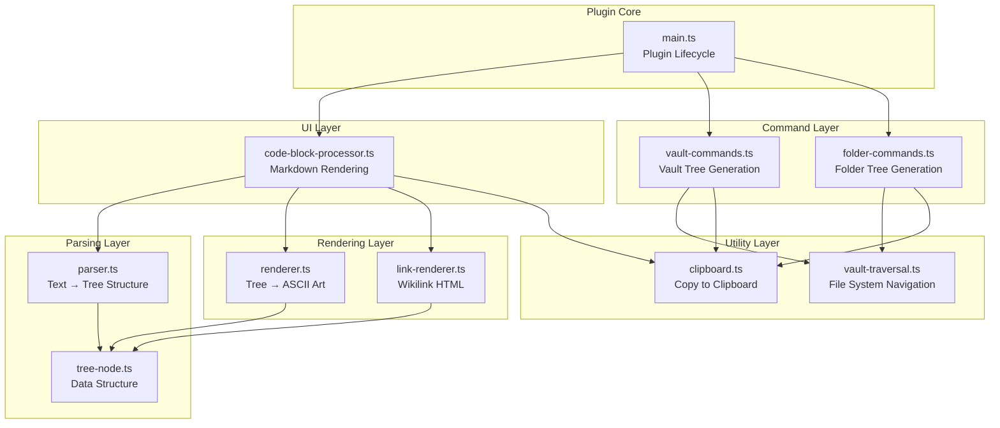

# Design Document: Tree Diagram Plugin

## Overview

The Tree Diagram Plugin extends Obsidian with the ability to render hierarchical tree diagrams from indented text within code blocks. The plugin provides a complete solution for visualizing and generating tree structures, including:

- **Parsing**: Converting tab-indented or space-indented text into tree node structures
- **Rendering**: Displaying trees using ASCII art with box-drawing characters (├──, └──, │)
- **Wikilink Support**: Extracting and rendering clickable Obsidian internal links within tree nodes
- **Clipboard Integration**: Copying rendered trees to the system clipboard
- **Vault Structure Commands**: Generating tree source text from vault folder hierarchies

The plugin follows Obsidian best practices by keeping `main.ts` minimal and organizing functionality into focused modules. All components are designed to be testable, maintainable, and extensible.

## Architecture

### High-Level Architecture



### Module Organization

Following Obsidian best practices, the codebase is organized into focused modules:

```
src/
  main.ts                      # Plugin entry point (minimal, lifecycle only)
  tree-diagram/
    parser.ts                  # Parse indented text into tree structures
    renderer.ts                # Render tree structures as ASCII art
    tree-node.ts               # Tree node data structure
    link-renderer.ts           # Render wikilinks as HTML
    code-block-processor.ts    # Process tree code blocks
  commands/
    vault-commands.ts          # Vault tree generation commands
    folder-commands.ts         # Current folder tree command
  utils/
    clipboard.ts               # Clipboard operations
    vault-traversal.ts         # Vault file system traversal
    sorting.ts                 # File/folder sorting utilities
  types.ts                     # TypeScript interfaces
```

### Design Principles

1. **Separation of Concerns**: Each module has a single, well-defined responsibility
2. **Pure Functions**: Parser and renderer are pure functions for testability
3. **Immutability**: Tree nodes are constructed immutably where possible
4. **Testability**: All core logic is decoupled from Obsidian API for unit testing
5. **Extensibility**: Components can be extended without modifying existing code

## Components and Interfaces

### Tree Node Data Structure

The `TreeNode` class represents a single node in the tree hierarchy:

```typescript
interface LinkObject {
  target: string;  // The wikilink target (note name or path)
  alias: string;   // The display text for the link
}

class TreeNode {
  name: string;              // Display name of the node
  depth: number;             // Distance from root (0 for root)
  parent: TreeNode | null;   // Reference to parent node
  children: TreeNode[];      // Array of child nodes
  isLast: boolean;           // Whether this is the last child of its parent
  link: LinkObject | null;   // Optional wikilink information
  
  constructor(name: string, depth: number, parent: TreeNode | null, link: LinkObject | null);
  addChild(child: TreeNode): void;
}
```

**Key Invariants**:
- Root node has `depth = 0` and `parent = null`
- For all non-root nodes: `depth = parent.depth + 1`
- Only the last child in `children` array has `isLast = true`
- All children have bidirectional parent reference: `child.parent === parent`

### Parser Module

The parser converts indented text into tree structures:

```typescript
interface ParseResult {
  root: TreeNode | null;  // null if input is empty or invalid
}

function parseTreeSource(source: string): ParseResult;
function extractWikilink(line: string): { link: LinkObject | null; remainingText: string };
function calculateDepth(line: string): number;
function findParentForDepth(currentNode: TreeNode, targetDepth: number): TreeNode;
```

**Parsing Algorithm**:
1. Split source text into lines
2. For each line:
   - Calculate depth from leading whitespace (tabs count as 2 spaces)
   - Extract wikilink if present (formats: `[[target]]` or `[[target|alias]]`)
   - Remove wikilink from line to get node name
   - If line is empty after processing, skip it
   - Determine parent based on depth relative to previous node
   - Create new TreeNode and add to parent
   - Update `isLast` flags for siblings

**Depth Calculation**:
- Count leading whitespace characters (tabs converted to 2 spaces)
- Divide by 2 to get depth level
- Example: `\t\t` (2 tabs) = 4 spaces = depth 2

**Wikilink Extraction**:
- Pattern: `\[\[([^\]|]+)(?:\|([^\]]+))?\]\]`
- Format `[[target|alias]]`: extract both target and alias
- Format `[[target]]`: use target for both target and alias
- Remove wikilink from line, use remaining text as node name
- If no remaining text, use alias as node name

### Renderer Module

The renderer converts tree structures into ASCII art:

```typescript
function renderTree(root: TreeNode | null): string[];
function renderNode(node: TreeNode): string;
function buildPrefix(node: TreeNode): string;
```

**Rendering Algorithm**:
1. Traverse tree in depth-first order
2. For each node:
   - Build prefix by examining ancestors
   - Add node-specific symbol (├──, └──, or none for root)
   - Append node name
   - Append wikilink if present
3. Return array of rendered lines

**Prefix Construction**:
- For each ancestor (excluding root):
  - If ancestor is not last child: add `│   ` (vertical bar + 3 spaces)
  - If ancestor is last child: add `    ` (4 spaces)
- For current node:
  - If root: no prefix
  - If last child: add `└── `
  - If not last child: add `├── `

**ASCII Symbols**:
- `├── ` : Non-last child connector
- `└── ` : Last child connector
- `│   ` : Vertical continuation line
- `    ` : Empty space (4 spaces)

### Link Renderer Module

The link renderer creates clickable HTML for wikilinks:

```typescript
function renderWikilink(link: LinkObject): HTMLElement;
function createInternalLink(target: string, displayText: string): HTMLAnchorElement;
```

**HTML Structure**:
```html
<a class="internal-link" data-href="target">alias</a>
```

**Link Handling**:
- Attach click event listener to prevent default behavior
- Use Obsidian's `app.workspace.openLinkText()` to navigate
- Resolve links relative to source note path

### Code Block Processor

The code block processor integrates parsing and rendering with Obsidian:

```typescript
function registerTreeCodeBlockProcessor(plugin: Plugin): void;
function processTreeCodeBlock(source: string, el: HTMLElement, ctx: MarkdownPostProcessorContext): void;
function createCopyButton(container: HTMLElement, content: string): HTMLButtonElement;
```

**Processing Flow**:
1. Obsidian detects code block with language `tree`
2. Parse source text into tree structure
3. Render tree structure as ASCII art
4. Create container with monospace font and preserved whitespace
5. Render wikilinks as clickable HTML elements
6. Add copy button to top-right corner
7. Attach event listeners for link clicks and copy button

**CSS Styling**:
```css
.tree-diagram-container {
  font-family: var(--font-monospace);
  white-space: pre;
  position: relative;
}

.tree-copy-button {
  position: absolute;
  top: 4px;
  right: 4px;
}
```

### Vault Commands Module

The vault commands generate tree source text from vault structure:

```typescript
function registerVaultCommands(plugin: Plugin): void;
function generateVaultTree(app: App, includeFiles: boolean): string;
function traverseFolder(folder: TFolder, depth: number, includeFiles: boolean): string[];
```

**Command IDs**:
- `copy-vault-tree-tabs`: Full vault tree (folders + files)
- `copy-vault-folders-tabs`: Folders only

**Generation Algorithm**:
1. Start at vault root
2. Recursively traverse folders
3. For each folder:
   - Get all children (folders and files)
   - Sort folders before files
   - Sort alphabetically within each category
   - Generate tab-indented line (tabs = depth)
   - Recurse into subfolders
4. Join lines and copy to clipboard
5. Show success notice

### Folder Commands Module

The folder commands generate tree source text from current note's folder:

```typescript
function registerFolderCommands(plugin: Plugin): void;
function generateCurrentFolderTree(app: App): string | null;
```

**Command ID**:
- `copy-current-folder-tabs`: Current note's parent folder tree

**Generation Algorithm**:
1. Get active note from workspace
2. If no active note, show error notice and return
3. Get parent folder of active note
4. Use same traversal algorithm as vault commands
5. Copy to clipboard and show success notice

### Clipboard Utility

The clipboard utility handles copying text to system clipboard:

```typescript
function copyToClipboard(text: string): Promise<boolean>;
function getElectronClipboard(): any | null;
```

**Implementation**:
1. Try to load Electron clipboard module (desktop only)
2. If available, use `electron.clipboard.writeText()`
3. If not available, use `navigator.clipboard.writeText()`
4. Return `true` on success, `false` on failure
5. Handle errors gracefully without throwing

### Vault Traversal Utility

The vault traversal utility navigates the Obsidian file system:

```typescript
function getAllFolders(folder: TFolder): TFolder[];
function getAllFiles(folder: TFolder): TFile[];
function sortVaultItems(items: (TFolder | TFile)[]): (TFolder | TFile)[];
```

**Sorting Rules**:
1. Folders come before files
2. Within each category, sort alphabetically by name
3. Case-insensitive comparison

## Data Models

### TreeNode

```typescript
class TreeNode {
  name: string;
  depth: number;
  parent: TreeNode | null;
  children: TreeNode[];
  isLast: boolean;
  link: LinkObject | null;
  
  constructor(name: string, depth: number, parent: TreeNode | null, link: LinkObject | null) {
    this.name = name;
    this.depth = depth;
    this.parent = parent;
    this.children = [];
    this.isLast = false;
    this.link = link;
  }
  
  addChild(child: TreeNode): void {
    // Mark previous last child as not last
    if (this.children.length > 0) {
      this.children[this.children.length - 1].isLast = false;
    }
    
    // Add new child
    child.parent = this;
    child.depth = this.depth + 1;
    child.isLast = true;
    this.children.push(child);
  }
}
```

### LinkObject

```typescript
interface LinkObject {
  target: string;  // The note name or path to link to
  alias: string;   // The display text for the link
}
```

### ParseResult

```typescript
interface ParseResult {
  root: TreeNode | null;  // null if input is empty or all lines are invalid
}
```

## Correctness Properties

*A property is a characteristic or behavior that should hold true across all valid executions of a system—essentially, a formal statement about what the system should do. Properties serve as the bridge between human-readable specifications and machine-verifiable correctness guarantees.*

### Property 1: Wikilink Extraction Correctness

*For any* line containing a wikilink in format `[[target]]` or `[[target|alias]]`, extracting the wikilink SHALL produce a LinkObject with the correct target and alias values, where single-bracket format uses target for both fields.

**Validates: Requirements 1.2, 1.3**

### Property 2: Text and Wikilink Separation

*For any* line containing both a wikilink and additional text, removing the wikilink portion SHALL preserve the remaining text as the node name, and when only a wikilink is present, the alias SHALL become the node name.

**Validates: Requirements 1.4, 1.5**

### Property 3: Depth Calculation from Whitespace

*For any* line with leading whitespace (spaces or tabs), calculating depth by dividing whitespace length by 2 (treating tabs as 2 spaces) SHALL produce the correct hierarchical level.

**Validates: Requirements 1.1**

### Property 4: Tree Construction from Depth Changes

*For any* sequence of lines with varying depths, constructing the tree SHALL correctly establish parent-child and sibling relationships based on depth increases, decreases, and equality relative to the previous node.

**Validates: Requirements 1.6, 1.7, 1.8**

### Property 5: Tree Structure Invariants

*For any* valid tree structure produced by parsing, all nodes SHALL maintain correct bidirectional parent-child references, accurate depth values, and proper isLast flags where only the last child of each parent is marked as last.

**Validates: Requirements 1.9, 1.10**

### Property 6: Node Prefix Rendering

*For any* non-root tree node, rendering SHALL produce the correct prefix symbol (`├── ` for non-last children, `└── ` for last children) based on the node's isLast flag.

**Validates: Requirements 2.2, 2.3**

### Property 7: Ancestor Prefix Calculation

*For any* tree node with ancestors, rendering SHALL include the correct prefix contribution from each ancestor (`│   ` for non-last ancestors, four spaces for last ancestors) to visually represent the hierarchical structure.

**Validates: Requirements 2.4, 2.5**

### Property 8: Wikilink HTML Generation

*For any* LinkObject, rendering SHALL produce an HTML anchor element with class `internal-link`, `data-href` attribute set to the target, and display text set to the alias.

**Validates: Requirements 4.1, 4.2**

### Property 9: Child Addition Maintains Invariants

*For any* parent node and child node, adding the child SHALL append it to the children array, set the child's parent reference to the parent, and set the child's depth to parent depth plus one.

**Validates: Requirements 9.2, 9.3, 9.4**

### Property 10: isLast Flag Management

*For any* parent node with multiple children, adding a new child SHALL mark the previous last child as not last and mark the new child as last, maintaining the invariant that only the final child has isLast = true.

**Validates: Requirements 9.5, 9.6**

### Property 11: Vault Structure Sorting

*For any* collection of vault items (folders and files), sorting SHALL place all folders before all files and sort items alphabetically within each category.

**Validates: Requirements 6.3, 6.4**

### Property 12: Tab Indentation Generation

*For any* tree structure being converted to source text, each line SHALL have a number of tab characters equal to its depth level.

**Validates: Requirements 6.5**

### Property 13: Invalid Line Skipping

*For any* line that contains only whitespace or has no name after removing wikilinks and whitespace, parsing SHALL skip that line without creating a tree node.

**Validates: Requirements 10.2, 10.3**

## Error Handling

### Parser Error Handling

**Empty Input**:
- Return `ParseResult` with `root = null`
- Renderer handles null root by producing empty output

**Invalid Lines**:
- Skip lines with only whitespace
- Skip lines with no name after wikilink removal
- Continue processing remaining lines

**Malformed Wikilinks**:
- If wikilink regex doesn't match, treat as plain text
- No error thrown, graceful degradation

### Renderer Error Handling

**Null Root**:
- Return empty string array
- Code block processor displays nothing

**Missing Node Properties**:
- Use default values (empty string for name, 0 for depth)
- Continue rendering other nodes

### Clipboard Error Handling

**Copy Failure**:
- Return `false` from `copyToClipboard()`
- UI shows "Fail" button text for 1200ms
- No exception thrown

**Electron Unavailable**:
- Fall back to `navigator.clipboard`
- If both fail, return `false`

### Command Error Handling

**No Active Note** (folder command):
- Show notice: "No active note"
- Do not attempt clipboard copy
- Return early from command

**Vault Traversal Errors**:
- Catch exceptions during folder traversal
- Log error to console
- Show generic error notice to user

### Plugin Lifecycle Error Handling

**Registration Failures**:
- Wrap registration calls in try-catch
- Log errors to console
- Continue loading other components

**Electron Module Load Failure**:
- Catch exception when requiring electron
- Set electron clipboard to null
- Fall back to navigator.clipboard

## Testing Strategy

### Unit Testing

Unit tests verify specific examples, edge cases, and error conditions:

**Parser Tests**:
- Empty input returns null
- Single line creates root node
- Wikilink extraction with various formats
- Depth calculation with spaces and tabs
- Mixed whitespace handling
- Lines with only wikilinks
- Lines with only whitespace

**Renderer Tests**:
- Null root produces empty output
- Single node (root only) has no prefix
- Two-level tree has correct symbols
- Wikilink appending format

**TreeNode Tests**:
- Constructor initializes all fields
- addChild updates parent reference
- addChild updates isLast flags
- Multiple children maintain correct order

**Clipboard Tests**:
- Success returns true
- Failure returns false
- Electron available uses electron.clipboard
- Electron unavailable uses navigator.clipboard

**Sorting Tests**:
- Empty array returns empty
- Folders before files
- Alphabetical within categories
- Case-insensitive comparison

### Property-Based Testing

Property tests verify universal properties across all inputs using randomized test data. Each test runs a minimum of 100 iterations.

**Test Framework**: Use `fast-check` for TypeScript property-based testing.

**Property Test Implementation**:
- Each correctness property (1-13) maps to one property-based test
- Tests generate random inputs (tree structures, wikilinks, whitespace patterns)
- Verify the property holds for all generated inputs
- Tag each test with: `Feature: tree-diagram-enhancement, Property {number}: {property_text}`

**Example Property Test Structure**:
```typescript
import fc from 'fast-check';

// Feature: tree-diagram-enhancement, Property 1: Wikilink Extraction Correctness
test('wikilink extraction preserves target and alias', () => {
  fc.assert(
    fc.property(
      fc.string(), // target
      fc.option(fc.string()), // optional alias
      (target, alias) => {
        const wikilink = alias ? `[[${target}|${alias}]]` : `[[${target}]]`;
        const result = extractWikilink(wikilink);
        
        expect(result.link).not.toBeNull();
        expect(result.link.target).toBe(target);
        expect(result.link.alias).toBe(alias || target);
      }
    ),
    { numRuns: 100 }
  );
});
```

**Generators**:
- `arbTreeNode()`: Generate random TreeNode instances
- `arbTreeStructure()`: Generate random valid tree structures
- `arbWikilink()`: Generate random wikilink strings
- `arbIndentedText()`: Generate random indented text with varying depths
- `arbVaultItems()`: Generate random collections of folders and files

### Integration Testing

Integration tests verify component interactions and Obsidian API integration:

**Code Block Processing**:
- Register processor for "tree" language
- Parse and render integration
- Copy button functionality
- Link click handling

**Command Registration**:
- All three commands are registered
- Commands appear in command palette
- Command callbacks execute correctly

**Vault Traversal**:
- Mock TFolder and TFile structures
- Verify traversal visits all items
- Verify sorting is applied

**Clipboard Integration**:
- Mock clipboard APIs
- Verify correct API is called
- Verify text content is correct

### Manual Testing

Manual testing verifies UI/UX and Obsidian integration:

**Visual Rendering**:
- Tree diagrams display correctly in reading mode
- Monospace font is applied
- Whitespace is preserved
- Copy button is positioned correctly

**Link Navigation**:
- Clicking wikilinks opens target notes
- Links resolve correctly relative to source
- Invalid links show Obsidian's default behavior

**Command Execution**:
- Vault tree commands copy to clipboard
- Folder command shows error when no active note
- Success notices appear
- Generated text is correctly formatted

**Mobile Compatibility**:
- Plugin loads on mobile
- Tree rendering works on mobile
- Commands work on mobile (if clipboard API available)

### Test Coverage Goals

- **Unit Tests**: 90%+ code coverage for parser, renderer, tree-node
- **Property Tests**: All 13 correctness properties implemented
- **Integration Tests**: All commands and processors registered and functional
- **Manual Tests**: All UI interactions verified on desktop and mobile

